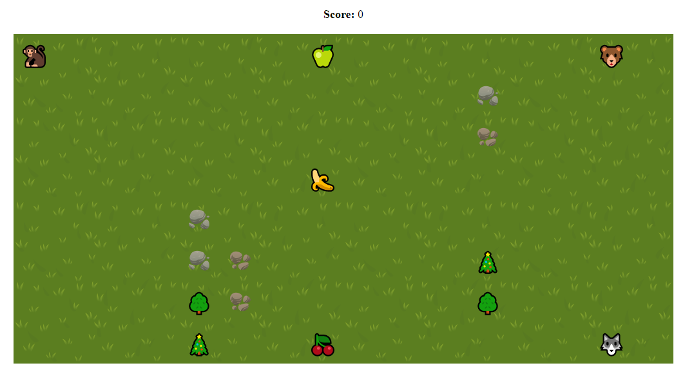

## GameComponent test assignment

Create a class hierarchy and implement key methods for a computer game. GameComponent's plot:


A player can move within a rectangular field with size Width * Height
There are some bonuses on the field (apples, cherries, bananas) which could be picked up by a player and give them score points
There are some monsters (wolves, bears) hunting the player and move using an algoritm
There are some obstacles on the field (stones, trees) which player and monster should avoid
The goal is to collect all bonuses and don't be eaten by monsters

## Solution

The solution is based on react vite app with [recoiljs](https://recoiljs.org/) as state manager. To run it locally use following commands:

```shell
yarn
yarn dev
```

Also, you can check demo here: [https://simple-game-task.netlify.app](https://simple-game-task.netlify.app)



